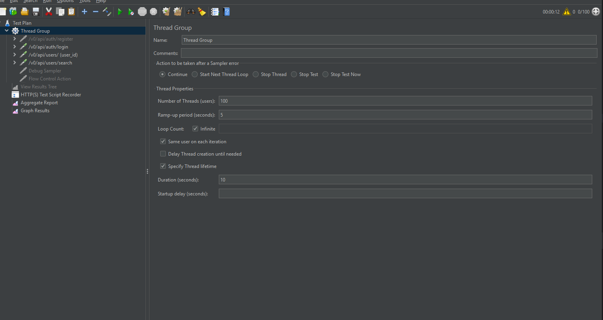
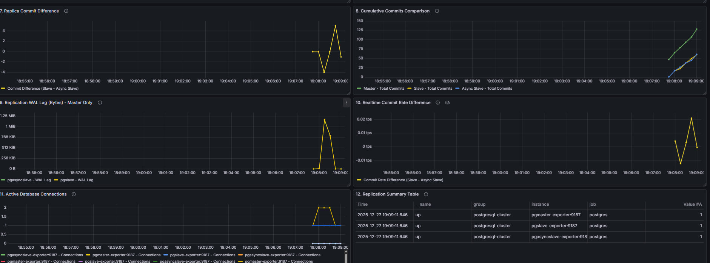
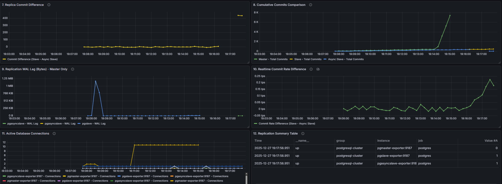

## 1. Домашнее задание по репликации

### Что было реализовано
- Настройка PostgreSQL с мастером и репликами
- Multi-datasource конфигурация в приложении
- Автоматический скрипт развертывания всей инфраструктуры

### Запуск инфраструктуры
```bash
./start-all и генерация юзеров ./06-generate.sh из папки scripts/replication-hw 
```

**Скрипт выполняет:**
- ✅ Инициализацию мастера и его настройку
- ✅ Создание пользователя `replicator`
- ✅ Конфигурацию аутентификации
- ✅ Бэкап и создание реплик
- ✅ Настройку синхронной реплики

### Профили приложения
- **`master-only`** - все запросы идут на мастер
- **`replication`** - чтение распределяется по репликам

**Настройка:** `docker-compose.yml` → перезапуск приложения

### Тестирование нагрузки

**JMeter конфигурация:** 

**Тестируемые endpoint'ы:**
- `POST /v0/api/auth/login`
- `GET /v0/api/users/{userId}`
- `GET /v0/api/users/search?firstName=&lastName=`

**🔧 Инструменты:**
- **Postman коллекция:** 
- **JMeter Test Plan:** 

###  Результаты тестирования

####  Режим `master-only`
| Метрика | Результат |
|---------|-----------|
| **JMeter** |  |
| **Grafana** |  |
| **Нагрузка** | 100% на мастере |

####  Режим `replication`
| Метрика | Результат |
|---------|-----------|
| **JMeter** |  |
| **Grafana** |  |
| **Нагрузка** | 0% на мастере (чтение) |

** Вывод:** Нагрузка на мастер снижена до 0, но производительность в JMeter ухудшилась.

###  Тестирование записи и failover

** Лаг репликации при запуске:**  


** Тест с отказом мастера:**
1. Нагрузка на `/v0/api/auth/register` (120 секунд)
2. Остановка мастера: `docker stop pgmaster pgmaster-exporter`
3. Запись останавливается
4. Промоут реплики: `./promote-slave.sh`
5. Проверка: `./diagnose-replication.sh`

** Результат:**  


** Проблема:** При восстановлении оригинального мастера возникает **split-brain**.  
** Решение:** Нужен failover инструмент (например, **patroni**).

## Выводы по репликации

###  Что работает хорошо:
- Чтение распределяется по репликам
- Нагрузка на мастер снижается до 0 при чтении
- Система продолжает работать при падении мастера (только чтение)

###  Проблемы:
- Производительность чтения может ухудшаться из-за синхронизации
- При восстановлении мастера возникает split-brain
- Ручной промоут реплики сложен и ненадежен

---

## 2.  Домашнее задание по кешированию

Сделано:
- Добавление/удаление друга
- CRUD для постов пользователей
- Сгенерированные данные - пользователи, посты, тяжелые пользователи, тестовый пользователь со связями с тяжелыми пользователями
- Лента у тестового пользователя содержит более 1000 постов в БД
- Обновление лент работает через очередь RabbitMQ
- Кеширование в Redis

Также добавлен liquibase для удобства добавления новых данных


###  Тестовый пользователь
| Поле | Значение |
|------|----------|
| **Email** | `test.user@example.com` |
| **Пароль** | `password` |

###  Подготовка инфраструктуры

#### 1. **Запуск окружения**
```bash
./start-all из папки scripts/replication-hw/
```
**Выполняет:**
-  Инициализация мастера
-  Создание пользователя replicator
-  Конфигурация аутентификации
-  Бэкап и создание реплик
-  Настройка синхронной реплики

#### 2. **Генерация тестовых данных**
```bash
scripts/generate-all-data-for-test.sh
```
**Создает:**
- Пользователей
- Посты
- Дружеские связи

### 🧪 Тестирование кеширования

```bash
# 1.  Авторизация
curl -X POST http://localhost:8080/v0/api/auth/login \
   -H "Content-Type: application/json" \
   -d '{"email": "test.user@example.com", "password": "password"}'

# 2.  Первый запрос ленты (кеш MISS)
curl -X GET http://localhost:8080/v0/posts/feed \
    -H "Authorization: Bearer $TOKEN" \
    -H "Content-Type: application/json"

# 3. ⚡ Повторный запрос ленты (кеш HIT)
curl -X GET http://localhost:8080/v0/posts/feed \
    -H "Authorization: Bearer $TOKEN" \
    -H "Content-Type: application/json"
```

### Анализ Redis кеша

```bash
# Подключение к Redis
docker exec -it redis redis-cli
```

| Команда | Описание |
|---------|----------|
| `KEYS *` | Все ключи кеша |
| `KEYS feed:*` | Ключи ленты (префикс `feed:`) |
| `TTL "feed:feed::test.user@example.com"` | Время жизни ключа |
| `TYPE "feed:feed::test.user@example.com"` | Тип данных |
| `GET "feed:feed::test.user@example.com"` | Получение значения |

###  Проверка данных в PostgreSQL

```sql
SELECT COUNT(*) as total_friend_posts
FROM posts p
WHERE p.author_id IN (
   SELECT friend_id
   FROM friendship
   WHERE user_id = (SELECT id FROM users WHERE email = 'test.user@example.com')
);
```

###  Что проверяем
1. **Работа кеширования** - второй запрос быстрее первого
2. **Данные в Redis** - наличие ключей `feed:*`
3. **Настройка TTL** - ограниченное время жизни кеша

---

## Выводы по кешированию

###  Что работает хорошо:
- Повторные запросы выполняются в разы быстрее
- Нагрузка на БД значительно снижается
- Простая реализация для часто читаемых данных

###  Проблемы:
- Риск устаревших данных в кеше
- Затраты на память Redis
- Сложность отладки при проблемах с кешем


## 3.  Домашнее задание по очередям

Сделано:

* Создание поста (метод /post/create из спецификации)
* Асинхронное API с websocket:
Реализовать отправку сообщений в канал /post/feed/posted через websocket, при добавлении нового поста друга подписчику websocket'а приходит событие о новом посте
* Реализовать отложенную материализацию ленты:
  Формирование лент работает через очередь (отложено)
  Обеспечена отправка только целевым пользователям


###  Тестовый пользователь
| Поле | Значение |
|------|----------|
| **Email** | `test.user@example.com` |
| **Пароль** | `password` |

###  Подготовка инфраструктуры

#### 1. **Запуск окружения**
```bash
./start-all из папки scripts/replication-hw/
```
**Выполняет:**
-  Инициализация мастера
-  Создание пользователя replicator
-  Конфигурация аутентификации
-  Бэкап и создание реплик
-  Настройка синхронной реплики

#### 2. **Генерация тестовых данных**
```bash
scripts/generate-all-data-for-test.sh
```
**Создает:**
- Пользователей
- Посты
- Дружеские связи

### 🧪 Тестирование вебсокета

Проверить, что в UI Rabbit есть exchange, queues, routing key

```bash

# 1. Регистрация
curl -X POST http://localhost:8080/v0/api/auth/register \
   -H "Content-Type: application/json" \
   -d '{
    "firstName": "Maria",
    "lastName": "Bortsova",
    "birthDate": "1996-01-01T10:00:00",
    "biography": "Java Developer",
    "city": "Moscow",
    "email": "maria12@test.com",
    "password": "123456"
}' 

curl -X POST http://localhost:8080/v0/api/auth/register \
   -H "Content-Type: application/json" \
   -d '{
    "firstName": "Maria",
    "lastName": "Friend",
    "birthDate": "1996-01-01T10:00:00",
    "biography": "Python Developer",
    "city": "Moscow",
    "email": "maria1243@test.com",
    "password": "123456"
}'
   
# 2.  Аутентификация
curl -X POST http://localhost:8080/v0/api/auth/login \
   -H "Content-Type: application/json" \
   -d '{
    "email": "maria1243@test.com",
    "password": "123456"
}'

# 3.  Добавить друга
curl -X POST http://localhost:8080/v0/api/users/email/maria12@test.com \
   -H "Content-Type: application/json" \
   -d '{
    "email": "maria1243@test.com",
    "password": "123456"
}'
-- id = fa4761f2-8826-40cb-ae9e-61d8a4a33f7f

curl -X POST http://localhost:8080/v0/api/friendship/fa4761f2-8826-40cb-ae9e-61d8a4a33f7f \
    -H "Authorization: Bearer $TOKEN" \
    -H "Content-Type: application/json"
    
# 3.  Создать пост
curl -X POST http://localhost:8080/v0/api/posts/ws \
    -H "Authorization: Bearer $TOKEN" \
    -H "Content-Type: application/json" \
    -d '{
    "text": "Мой первый пост!"
}'
```

Откройте http://localhost:15672 → Queues → увидите сообщения в очередях

В логах можно увидеть, что вебсокет работает

```
2026-01-31T15:33:40.498+03:00 DEBUG 8600 --- [social-network] [nio-8080-exec-3] o.s.m.s.b.SimpleBrokerMessageHandler     : Processing MESSAGE destination=/topic/feed session=null payload={"type":"post.posted","data":{"id":"7241445a-170a-48cb-94e7-7e141b8f3a5e","text"...(truncated)
2026-01-31T15:33:40.498+03:00  INFO 8600 --- [social-network] [nio-8080-exec-3] c.o.h.s.WebSocketNotificationService     : Broadcast WebSocket notification for post: 7241445a-170a-48cb-94e7-7e141b8f3a5e
2026-01-31T15:33:40.498+03:00  INFO 8600 --- [social-network] [nio-8080-exec-3] com.otus.highload.service.PostService    : Post created: 7241445a-170a-48cb-94e7-7e141b8f3a5e
2026-01-31T15:33:40.501+03:00  INFO 8600 --- [social-network] [ntContainer#1-1] c.otus.highload.service.RabbitConsumer   : Processing regular post: 7241445a-170a-48cb-94e7-7e141b8f3a5e
2026-01-31T15:34:31.349+03:00  INFO 8600 --- [social-network] [MessageBroker-1] o.s.w.s.c.WebSocketMessageBrokerStats    : WebSocketSession[0 current WS(0)-HttpStream(0)-HttpPoll(0), 0 total, 0 closed abnormally (0 connect failure, 0 send limit, 0 transport error)], stompSubProtocol[processed CONNECT(0)-CONNECTED(0)-DISCONNECT(0)], stompBrokerRelay[null], inboundChannel[pool size = 0, active threads = 0, queued tasks = 0, completed tasks = 0], outboundChannel[pool size = 0, active threads = 0, queued tasks = 0, completed tasks = 0], sockJsScheduler[pool size = 1, active threads = 1, queued tasks = 0, completed tasks = 0]

```


