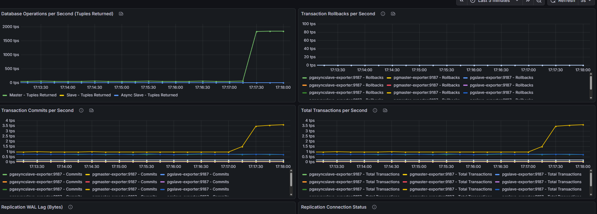
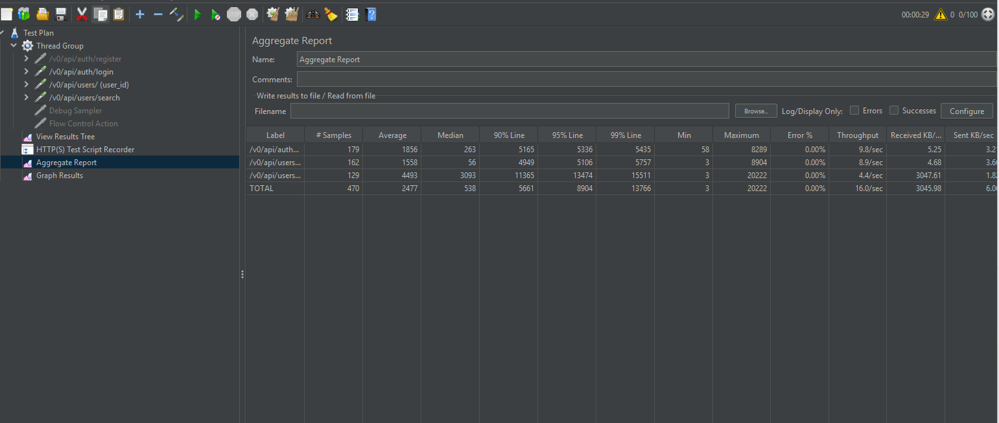
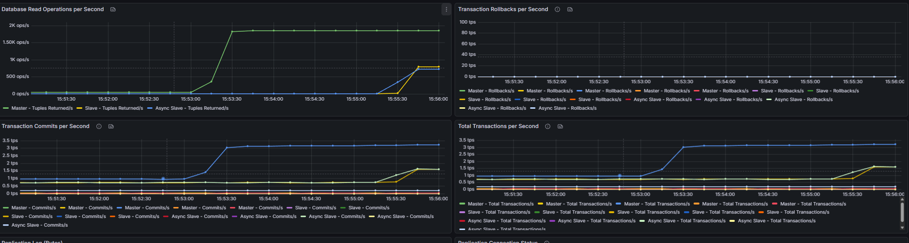

Реализован multi datasources

Запустить инфраструктуру - ./start-all из папки scripts
    - инициализация мастера и его настройка
    - создание юзера replicator
    - конфигурация аутентификации
    - бэкап и создании реплик
    - настройка синхронной реплики
    - генерация данных в таблице users (1 000 000 записей)

Есть профили в приложении master-only и replication (установить в docker-compose.yml и перезапустить)

Нагрузку подаем в JMeter, параметры 

Тестируем чтение на ручках /v0/api/auth/login, /v0/api/users/{userId}, /v0/api/users/search?firstName=&lastName= 
(заранее зарегистрировать пользователя, чтобы подставить email/password в login, в postman коллекции определен пользователь, которого регистрирую)

Postman коллекция 

Test Plan JMeter 

Поведение master-only:
Установим приложение в master-only и дадим нагрузку

Поведение replication:
Установим приложение в replication и дадим нагрузку

Вывод по запросам чтения: нагрузка на мастер снижена до 0, но по jmeter стало хуже

Нагрузка на запись без failover:

Приложение в replication профиле

Уже при запуске всей инфры видно лаг репликаций, так как было сгенерировано 1 миллион записей 

Поставим в JMeter 120 секунд, чтобы увидеть Lag

Создаем нагрузку на ручку /v0/api/auth/register, ждем 1 минуту

Отключаем master - узел docker stop pgmaster pgmaster-exporter, запись останавливается

Останавливаем нагрузку в JMeter

Промоутим слейв до мастера, переключаем на него второй слейв - ./promote-slave.sh и проверка ./diagnose-replication.sh

Результат 

Если обратно поднимать оригинальный мсастер, то будет split-brain master, в таком случае нужен failover (patroni, например)
